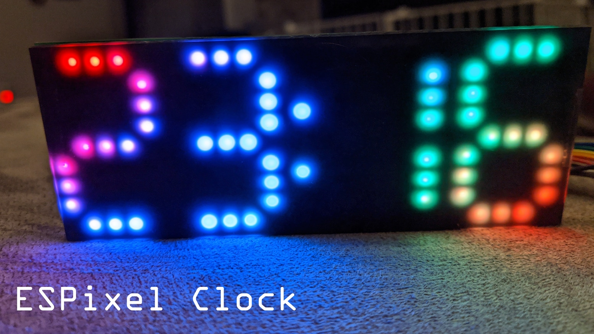

# ESPixelClock

Collection of code examples for the ESPixelClock

[This](https://github.com/mattncsu/ESPixelClock/tree/master/examples/ESPixelClock) is the code that comes pre-flashed on clocks that shipped with an ESP32 attached.

For those starting off with a bare board, I recommend taking a look at the examples in the [simple](https://github.com/mattncsu/ESPixelClock/tree/master/examples/simple) folder because they'll be easier to adapt to other microcontrollers.
