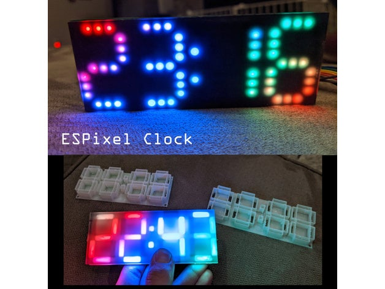

Here is a place to post cases, enclosures, and other miscellaneous bits.

[DXF](hardware/Neo7Segment3535.dxf) and [STL](hardware/ESPixelClock_Board.stl) files are posted in the hardware folder to facilitate new designs.

[Light Diffuser](https://www.thingiverse.com/thing:4218698): This offsets the LEDs from the opaqe screen a bit causing the individual pixels to blur together:

[Simple Enclosure](https://www.thingiverse.com/thing:4145818): Simple enclosure design by Jason Coon:

[ESPixelClock Case](https://www.thingiverse.com/thing:4355887): Nice design by Tedder:
~[photo](https://cdn.thingiverse.com/assets/db/9c/6e/50/e2/featured_preview_2020-05-11_09.59.41.jpg)
